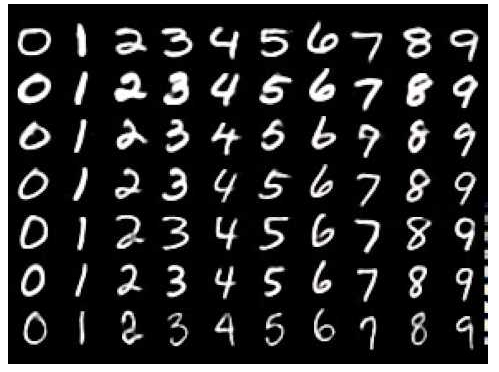

```{r setup, echo = FALSE}

knitr::opts_chunk$set(
  echo = TRUE,
  message = FALSE,
  warning = FALSE,
  fig.align = 'center',
  dev = c("svg"),
  dpi = 500
)

htmltools::img(
  src = knitr::image_uri(here::here("01_data", "img", "logo.png")),
  alt = 'logo',
  style = 'position:absolute; top:0; right:0; padding:45px;'
)
```

Dieses Dokument beschreibt die Ausarbeitung der ersten Aufgabe des Abschlussprojekts (Machine Learning ILV W2020 an der Fachhochschule Wiener Neustadt). Es enthält sowohl den R-Code zur Lösung der Aufgabenstellung als auch die entsprechende Dokumentation beziehungsweise Beschreibung.

Im Folgenden werden verschiedene Machine Learning-Modelle auf den MNIST-Datasatz (in unterschiedlichen Größen) trainiert und hinsichtlich Rechenzeit und Klassifikationsergebnis verglichen. Der vorliegende Workflow soll nicht als Best Practice verstanden werden, um ein möglichst gutes Modell zu trainineren, sondern stellt lediglich eine unsystematische Exploration von Modellparametern und -merkmalen in Form eines Benchmarks dar. Unter anderem folgende Aspekte werden in diesem Zusammenhang nicht berücksichtigt beziehungsweise behandelt:

* *Systematische* Variation von Parametern um ein möglichst gutes Modell zu finden (z.B. mittels Grid Search wie bei vielen Machine Learning-Workflows üblich)
* Die Verwendung eines Validation Sets beziehungsweise Cross Validation für das Training des Modells. Stattdessen wird jedes Modell nur mit dem jeweiligen Test Set evaluiert, was in der Praxis nicht empfehlenswert ist.
* Da auch für jedes einzelne Modell dessen Trainingszeit betrachtet wird, wird darüber hinaus weitestgehend von der Verwendung von vordefinierten Funktionalitäten abgesehen, die den Machine Learning Workflow über verschiedene Modellklassen hinweg vereinheitlichen beziehungsweise vereinfachen (z.B. via `caret` oder `tidymodels`).

# Import der benötigten Pakete

```{r}
library(e1071) # für Support Vector Machines
library(ranger) # für Random Forests
library(xgboost) # für Boosting
library(keras) # für Neural Networks
library(caret) # für Confusion
library(tidyverse) # für Datenaufbereitung und -visualisierung

theme_set(theme_bw())
```

# Vorbereitung des Datensatzes

Der MNIST-Datensatz enthält Bilder handgeschriebener Zahlen in einer Auflösung von 28 x 28 Pixeln.

<center>  </center>

Da im Rahmen der Ausarbeitung auch der Einfluss der Datenmenge (d.h., Anzahl der Samples) auf die Modellperformance berücksichtigt werden soll, werden drei unterschiedliche große Datensätze vorbereitet. Außerdem ist zu berücksichtigen, dass je nach Algorithmus bzw. Implementierung die Daten in unterschiedlicher Form aufbereitet werden müssen.

Die folgende Funktion abstrahiert die Extraktion und das Reshaping des MNIST-Datensatzes in bestimmter Größe (sowohl eine "flache Version" der Daten wird zurückgegeben als auch eine mehrdimensionale, die als Input für die `keras`-Modelle benutzt wird).

```{r}
prepare_mnist <- function(train_size, test_size) {
  mnist = dataset_mnist()
  
  c(c(train_images, train_labels),
    c(test_images, test_labels)) %<-% mnist
  
  train_images <- train_images[1:train_size, , ]
  train_labels <- train_labels[1:train_size]
  test_images <- test_images[1:test_size, , ]
  test_labels <- test_labels[1:test_size]

  train_images <- train_images / 255
  test_images <- test_images / 255
  
  # Umformen in zweidimensionale Arrays
  train_images_flat <- array_reshape(train_images, c(train_size, 784))
  test_images_flat  <- array_reshape(test_images, c(test_size, 784))
  
  train_labels_flat <- train_labels
  test_labels_flat <- test_labels
  
  # Umformen in höherdimenionale Arrays (für keras)
  train_images_2d <- array_reshape(train_images, c(train_size, 28, 28, 1))
  test_images_2d <- array_reshape(test_images, c(test_size, 28, 28, 1))
  
  train_labels_2d <- to_categorical(train_labels)
  test_labels_2d <- to_categorical(test_labels)

  
  return(
    list(
      flat = list(
        x_train = train_images_flat,
        y_train = train_labels_flat,
        x_test = test_images_flat,
        y_test = test_labels_flat
      ),
      two_d = list(
        x_train = train_images_2d,
        y_train = train_labels_2d,
        x_test = test_images_2d,
        y_test = test_labels_2d
      )
    )
  )
}
```

Im Folgenden wird die Funktion benutzt, um Datensätzen in drei unterschiedlichen Größen zu generieren (sowohl flach als auch mehrdimensional). Aus Gründen der Berechnungszeit (durch die sich aus der Anzahl von Classifern, Anzahl verschiedener Parameter und Datensätze unterschiedlicher Größe ergibt) wird nie der gesamte Datensatz zum Training verwendet.

```{r}
data_list <- transpose(
    map2(
      list(500, 2000, 20000),
      list(100, 400, 4000),
      ~ prepare_mnist(.x, .y)
      )
    )

n_data <- length(data_list$flat)

data_list_flat <- transpose(data_list$flat) 
data_list_2d <- transpose(data_list$two_d) 
```

# Benchmarking der verschiedenen Machine Learning-Modelle

Im Folgenden werden für die vier verschiedenen Typen von Machine Learning-Modellen (Support Vector Machine, Random Forest, Extreme Gradient Boosting und Neural Networks) unterschiedliche Parameter und die Größe der Datensätze variiert und Modellperformance und Rechenzeit dokumentiert. Aufgrund der hohen Anzahl verschiedener Modelle werden pro Modell-Typ nur je zwei Parameter varriiert. Bei den Neural Networks werden zwei Modelle mit unterschiedlicher Architektur betrachtet (ein einfaches und ein komplexeres Modell).

## Support Vector Machines

Funktion, die Training, Evaluierung und Messung der Rechenzeit abstrahiert:

```{r}
eval_svm <- function(x_train, y_train, x_test, y_test, kernel, cost) {
  y_train <- as.factor(y_train)
  y_test <- as.factor(y_test)
  
  start_time <- proc.time()
  
  model <- svm(x_train, y_train, kernel = kernel, cost = cost)
  preds <- predict(model, x_test)
  
  end_time <- proc.time()
  diff_time <- end_time - start_time
  
  conf_mat <- confusionMatrix(preds, y_test)
  
  return(
    list(model = "Support Vector Machine",
         param_1 = paste("kernel:", kernel),
         param_2 = paste("cost:", cost),
         n_samples = nrow(x_train),
         time = diff_time,
         elapsed_time = diff_time[[3]],
         conf_mat = conf_mat,
         test_acc = conf_mat$overall[["Accuracy"]])
  )
}
```

Mappen der Funktion über unterschiedlich große Datensätze sowie verschiedene Parameter - dabei werden der `kernel` und der `cost`-Hyperparameter (Kosten für Contraint Violation) variiert:

```{r}
svm_param_list <-  map(data_list_flat, ~ append(.x, .x)) %>% 
  append(list(kernel = c(rep("linear", n_data), rep("radial", n_data)))) %>% 
  append(list(cost = c(rep(0.1, n_data), rep(0.01, n_data))))

svm_results <- pmap(
  .l = svm_param_list,
  .f = function(x_train,
                y_train,
                x_test,
                y_test,
                kernel,
                cost)
    eval_svm(
      x_train = x_train,
      y_train = y_train,
      x_test = x_test,
      y_test = y_test,
      kernel = kernel,
      cost = cost
    )
)
```

## Random Forests

Funktion, die Training, Evaluierung und Messung der Rechenzeit abstrahiert:

```{r}
eval_rf <- function(x_train, y_train, x_test, y_test, num_trees, max_depth) {
  train_df <- as.data.frame(cbind(x_train, y_train =  y_train))
  x_test_df <- as.data.frame(x_test)
  y_test <- as.factor(y_test)
  
  start_time <- proc.time()
  
  model <- ranger(y_train ~ .,
                  data = train_df,
                  classification = TRUE,
                  num.trees = num_trees,
                  max.depth = max_depth)
  preds <- predict(model, x_test_df)
  
  end_time <- proc.time()
  diff_time <- end_time - start_time
  
  conf_mat <- confusionMatrix(as.factor(preds$predictions), y_test)
  
  return(
    list(model = "Random Forest",
         param_1 = paste("num_trees:", num_trees),
         param_2 = paste("max_depth:", max_depth),
         n_samples = nrow(x_train),
         time = diff_time,
         elapsed_time = diff_time[[3]],
         conf_mat = conf_mat,
         test_acc = conf_mat$overall[["Accuracy"]])
  )
}
```

Mappen der Funktion über unterschiedlich große Datensätze sowie verschiedene Parameter - dabei werden die Anzahl und Tiefe der Bäume variiert:

```{r}
rf_param_list <-  map(data_list_flat, ~ append(.x, .x)) %>%
  append(list(num_trees = c(rep(500, n_data), rep(1000, n_data)))) %>%
  append(list(max_depth = c(rep(4, n_data), rep(9, n_data))))

rf_results <- pmap(
  .l = rf_param_list,
  .f = function(x_train,
                y_train,
                x_test,
                y_test,
                num_trees,
                max_depth)
    eval_rf(
      x_train = x_train,
      y_train = y_train,
      x_test = x_test,
      y_test = y_test,
      num_trees = num_trees,
      max_depth = max_depth
    )
)
```

## Boosting

Funktion, die Training, Evaluierung und Messung der Rechenzeit abstrahiert (es wird ein Boosting Classifier auf Basis eines Trees - Alternative wäre eine linearer Classifier - verwendet und die Anzahl der Boosting-Iterationen ist auf 20 fixiert):

```{r}
eval_boost <- function(x_train, y_train, x_test, y_test, eta = eta, max_depth = max_depth, n_rounds = 20) {
  xgb_train = xgb.DMatrix(data = x_train, label = y_train)
  xgb_test = xgb.DMatrix(data = x_test, label = y_test)
  y_test <- as.factor(y_test)
  
  start_time <- proc.time()
  
  model <- xgb.train(data = xgb_train,
                       nrounds = n_rounds,
                       booster = "gbtree",
                       eta = eta,
                       max_depth = max_depth,
                       num_class = 10)
  preds <- predict(model, xgb_test, reshape = TRUE)
  
  end_time <- proc.time()
  diff_time <- end_time - start_time
  
  preds <- as.data.frame(preds)
  conf_mat <- confusionMatrix(as.factor(preds[[1]]), y_test)
  
  return(
    list(model = "Extreme Gradient Boosting",
         param_1 = paste("eta:", eta),
         param_2 = paste("max_depth:", max_depth),
         n_samples = nrow(x_train),
         time = diff_time,
         elapsed_time = diff_time[[3]],
         conf_mat = conf_mat,
         test_acc = conf_mat$overall[["Accuracy"]])
  )
}
```

Mappen der Funktion über unterschiedlich große Datensätze sowie verschiedene Parameter - dabei werden die Tiefe des Baums und die Learning Rate (`eta`) variiert:

```{r}
boost_param_list <-  map(data_list_flat, ~ append(.x, .x)) %>% 
  append(list(eta = c(rep(0.2, n_data), rep(0.7, n_data)))) %>% 
  append(list(max_depth = c(rep(4, n_data), rep(9, n_data))))

boost_results <- pmap(
  .l = boost_param_list,
  .f = function(x_train,
                y_train,
                x_test,
                y_test,
                eta,
                max_depth)
    eval_boost(
      x_train = x_train,
      y_train = y_train,
      x_test = x_test,
      y_test = y_test,
      eta = eta,
      max_depth = max_depth
    )
)
```

## Neuronale Netzwerke

Funktion, die Training, Evaluierung und Messung der Rechenzeit abstrahiert:

```{r}
inverse_to_categorical <- function(mat) {
  apply(mat, 1, function(row) which(row == max(row)) - 1)
}

eval_nn <- function(model, x_train, y_train, x_test, y_test) {
  start_time <- proc.time()
  
  model %>% 
  compile(
    optimizer = "rmsprop",
    loss = "categorical_crossentropy",
    metrics = c("accuracy")
  )
  
  model %>% fit(x_train, y_train, epochs = 5, batch_size = 64)
  preds <- model %>% predict_classes(x_test)
  
  end_time <- proc.time()
  diff_time <- end_time - start_time
  
  conf_mat <- confusionMatrix(as.factor(preds),
                            as.factor(inverse_to_categorical(y_test)))
  
  return(
  list(model = "Neural Network",
       param_1 = paste("num_params:", count_params(model)),
       param_2 = paste("num_layers:", length(model$layers)),
       n_samples = nrow(x_train),
       time = diff_time,
       elapsed_time = diff_time[[3]],
       conf_mat = conf_mat,
       test_acc = conf_mat$overall[["Accuracy"]])
  )
}
```

Modelle initiieren, die evaluiert werden sollen (ein einfaches Modell mit zwei Convolutional Layers und weniger Filtern sowie ein komplexeres Modell mit drei Convolutional Layers und mehr Filtern):

```{r}
# Ein einfaches Modell
cnn_model_1 <- keras_model_sequential() %>% 
  layer_conv_2d(filters = 16, kernel_size = c(3, 3), activation = "relu",
                input_shape = c(28, 28, 1)) %>% 
  layer_max_pooling_2d(pool_size = c(2, 2)) %>% 
  layer_conv_2d(filters = 32, kernel_size = c(3, 3), activation = "relu") %>% 
  layer_max_pooling_2d(pool_size = c(2, 2)) %>% 
  layer_flatten() %>% 
  layer_dense(units = 64, activation = "relu") %>% 
  layer_dense(units = 10, activation = "softmax")

# Ein etwas komplexeres Modell
cnn_model_2 <- keras_model_sequential() %>% 
  layer_conv_2d(filters = 32, kernel_size = c(3, 3), activation = "relu",
                input_shape = c(28, 28, 1)) %>% 
  layer_max_pooling_2d(pool_size = c(2, 2)) %>% 
  layer_conv_2d(filters = 64, kernel_size = c(3, 3), activation = "relu") %>% 
  layer_max_pooling_2d(pool_size = c(2, 2)) %>% 
  layer_conv_2d(filters = 64, kernel_size = c(3, 3), activation = "relu") %>% 
  layer_flatten() %>% 
  layer_dense(units = 64, activation = "relu") %>% 
  layer_dense(units = 10, activation = "softmax")
```

Mappen der Funktion über unterschiedlich große Datensätze sowie verschiedene Modelle:

```{r}
nn_param_list <-  map(data_list_2d, ~ append(.x, .x)) %>% 
  append(list(model = list(cnn_model_1,
                           clone_model(cnn_model_1),
                           clone_model(cnn_model_1),
                           cnn_model_2,
                           clone_model(cnn_model_2),
                           clone_model(cnn_model_2))))

nn_results <- pmap(
  .l = nn_param_list,
  .f = function(model,
                x_train,
                y_train,
                x_test,
                y_test)
    eval_nn(
      model = model,
      x_train = x_train,
      y_train = y_train,
      x_test = x_test,
      y_test = y_test
    )
)
```

# Organisieren der Ergebnisse in ein einheitliches, leicht zugängliches Format

Im Folgenden werden die Ergebnisse in Bezug auf die verschiedenen Modell-Typen zusammengeführt und in ein zugängliches Format zur Visualisierung und Exploration gebracht.

```{r}
full_results <- do.call(rbind,
                        Map(rbind,
                            svm_results,
                            rf_results,
                            boost_results,
                            nn_results)) %>%
  as.tibble() %>% 
  arrange(model)

tidy_results <- full_results %>%
  select(-c(conf_mat, time)) %>%
  mutate(across(everything(), unlist)) %>%
  mutate(n_samples = paste("n_samples:", n_samples)) %>% 
  unite(model_desc, model, n_samples, param_1, param_2, sep = ", ", remove = FALSE) %>% 
  mutate(model_desc = factor(model_desc, levels = rev(.$model_desc)))
```

# Beantwortung der Fragestellungen

## (a) Welche Unterschiede hinsichtlich Klassifkationsergebnis bzw. Laufzeit sind ersichtlich? Wie wirkt sich in diesem Zusammenhang die die Anzahl der Traingsbeispiele aus?

Plot zur Laufzeit:

```{r, fig.width = 10, fig.height = 8, dev="svg"}
tidy_results %>% 
  ggplot(aes(x = model_desc, y = elapsed_time)) +
  geom_col(aes(fill = model)) +
  geom_text(aes(label = round(elapsed_time, 2)), hjust = -0.5) +
  coord_flip() +
  labs(y = "Benötigte Berechnungszeit (s)",
       x = NULL) +
  theme(legend.position = "top") +
  scale_fill_manual(values = c("#9D5A6C", "#5A4A6F",  "#E47250", "#EBB261"), name = NULL) +
  expand_limits(y = c(0, 1200))
```

Im Plot oben sind verschiedene Aspekte auffällig:

* Die Anzahl der Samples wirkt sich teilweise enorm auf die Trainingsdauer aus. Dieses Muster ist über alle Modelltypen und Konfigurationen erkennbar und ist je nach Modell unterschiedlich stark ausgeprägt.
* Vor allem die verwendete SVM-Implementierung skaliert mit einem großen Datensatz sehr schlecht (insbesondere bei der Verwendung eines `radial`-Kernels). Das SVM-Modell mit `radial`-Kernel trainiert auf 20000 Samples ist ein enormer Ausreißer in Bezug auf die betrachteten Modelle und zeigt auch, dass nicht nur die Anzahl der Samples Auswirkung auf die Rechenzeit haben kann (sondern eben auch bestimmte Parameter).
* Neural Netwworks sind bei wenigen Samples vergleichweise langsam gegenüber anderen Algorithmen beziehungsweise Implementierungen, skalieren jedoch sehr gut mit größeren Datensätzen und können dann hinsichtlich Berechnungszeit mit anderen Modelltypen mithalten. Die Unterschiede bezüglich der Berechnungszeit zwischen den beiden unterschiedlich komplexen Neural-Network-Modellen sind in diesem Beispiel insgesamt nur geringfügig.
* Die Boosting-Implementierung kann bezüglich der Effizienz gut mit anderen Modellen mithalten (zu bemerken ist, dass beim vorliegenden Modell "nur" 20 Boosting-Iterationen verwendet wurden). 
* Auffallend effizient ist die hier verwendete Random Forest-Implementierung (über das `ranger`-Package). Es skaliert sehr gut und weist auch bei einem großen Datensatz durchweg die kürzesten Rechenzeiten auf.

Plot zum Klassifiaktionergebnis (Test Accuracy):

```{r, fig.width = 10, fig.height = 8, dev = "svg"}
tidy_results %>% 
  ggplot(aes(x = model_desc, y = test_acc)) +
  geom_col(aes(fill = model)) +
  geom_text(aes(label = round(test_acc, 2)), hjust = -0.5) +
  coord_flip() +
  labs(y = "Test Accuracy",
       x = NULL) +
  theme(legend.position = "top") +
  scale_fill_manual(values = c("#9D5A6C", "#5A4A6F",  "#E47250", "#EBB261"), name = NULL) +
  expand_limits(y = c(0, 1.2))
```

In Bezug auf das Klassifikationsergebnis (siehe obigen Plot) sind unter anderem folgende Aspekte auffällig:

* Nahezu alle Modelle performen mit steigender Sample-Anzahl besser.
* Neural Networks performen eher schlecht mit wenig Daten, ziehen bei einem größeren Datensatz aber an anderen Modellen vorbei und weisen insgesamt ide beste Performance auf.
* Random Forest und Boosting liegen bei diesem Beispiel insgesamt im Mittelfeld hinsichtlich Performance.
* Support Vector Machines (mit bestimmter Parameter-Kombination) weisen bei kleinen Datensätze die beste Performance auf.

## (b) Wie wirken sich Parameteränderungen (z.B. Anwendung einer anderen kernel function, Anzahl von weak classifers, Anzahl von Bäumen, unterschiedliche loss functions, Anzahl von hidden layers, etc.) auf das Klassifkationsergebnis aus (Fehlerraten, Confusion Matrix, etc.)?

Zu Beantwortung dieser Frage wird wieder Bezug auf den obigen Plot genommen (Plot zum Klassifikationsergebnis). Innerhalb der unterschiedlichen Modelltypen lassen sich einige Performance-Unterschiede erkennen, die auf die jeweilige Parameterkombination zurückgeführt werden können, zum Beispiel:

* Die Support Vector Machine mit Radial-Kernel und Cost-Hyperparamter von 0.01 performt wesentlich schlechter als das Äquivalent mit einem linearen Kernel und Cost-Hyperparameter von 0.1. Wodurch diese starken Unterschiede genau zu Standeekommen, müsste in zusätzlichen Experimenten geprüft werden.
* Der Random Forest mit 1000 Bäumen (und tieferen Bäumen) performt durchweg besser als einer mit nur 500. Das spricht dafür, dass mehr (und komplexere) Classifier (Bäume) benötigt werden, um der Komplexität des vorliegenden Klassifikationsproblems gerecht zu werden.
* Auch das Boosting-Modell performrt mit höherer Baumtiefe (und höherer Learning Rate `eta`) besser.
* Bei den Neural Networks zeichnet sich erst ab einer gewissen Anzahl von Trainings-Samples ab, dass das komplexere Modell besser performt.

Hinweis: Da der MNIST-Datensatz relativ ausbalanciert ist (mit einer ähnlichen Anzahl von Samples pro Klasse), wurde im Rahmen des vorliegenden Benchmarks nur die Test Accuracy betrachtet. Weitere Metriken, die Confusion-Matrices und Werte zur Klassifikationsperformance in Bezug auf einzelne Klassen sind zur genaueren Exploration im Objekt `full_results` unter dem Attribut `conf_mat` enthalten.

## (c) Was fällt auf, wenn die Berechnungen mehrfach unabhängig voneinander ausgeführt werden?

Es ist zu erwarten, dass Algorithmen, die Zufallskomponenten beinhalten, sich in ihren Ergebnissen von Training zu Training unterscheiden können - dies würde zum Beispiel auf Random Forests und auch auf bestimmte Boosting-Algorithmen und Neural Networks zutreffen. Bei Support Vector Machines wäre eine solche Fluktuation in der Regel nicht zu erwarten.

Im Folgenden wird diese Annahme anhand eines Random Forests und anhand einer Support Vector Machine überprüft. Zunächst ein Random Forest-Modell, das mehrmals auf dieselben Daten mit denselben Parametern trainiert wird:

```{r}
map_dbl(
  1:10,
  ~ eval_rf(rf_param_list$x_train[[1]],
        rf_param_list$y_train[[1]],
        rf_param_list$x_test[[1]],
        rf_param_list$y_test[[1]],
        500,
        6)$test_acc
)
```

Anschließend ein Support Vector Machine-Modell, das mehrmals auf die dieselben Daten mit denselben Parametern trainiert wird:

```{r}
map_dbl(
  1:10,
  ~ eval_svm(
    svm_param_list$x_train[[1]],
    svm_param_list$y_train[[1]],
    svm_param_list$x_test[[1]],
    svm_param_list$y_test[[1]],
    "linear",
    0.1
  )$test_acc
)
```

Es zeigt sich, dass sich beim Random Forest die Ergebnisse von Iteration zu Iteration geringfügig unterscheiden, was bei der Support Vector Machine nicht der Fall ist. Dies hängt mit der Zufallskomponente der Random Forests zusammen und solche Fluktuationen wäre auch bei Neural Network (und ggf. auch beim Boosting) zu erwarten.

## (d) Welches Verfahren würden Sie für die vorliegende Aufgabenstellung in der Praxis anwenden?

Unter der Annahme, dass man ausreichend Rechenkapazität und einen großen Datensatz zu Verfügung hat, würde ich die Verwendung eines Neural Networks bevorzugen. Ab einer bestimmten Datenmenge (und Verfügbarkeit eines GPUs - in dem Fall ein NVIDIA GeForce GTX 1660 TI) ist die Geschwindgkeit des Trainings von Neural Networks vergleichbar mit anderen Modelltypen (außer vielleicht die hocheffiziente Random Forest-Implementierung des `ranger`-Packages) und lassen bezüglich der Klassifikations-Performance andere Modelle hinter sich (zumindest bei der MNIST-Klassifikation).